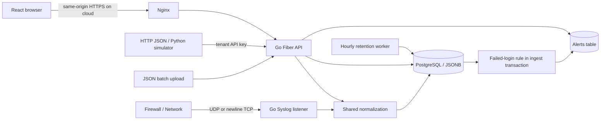

# Architecture

## Design decisions

- React is a client-side application built by Vite; all backend work stays in Go Fiber.
- One backend binary hosts HTTP, bounded Syslog listeners and cleanup. No queue or distributed orchestration in the initial demo.
- Shared Normalize function maps JSON providers into timestamp/tenant/source/event_type/severity/src_ip/user/host/action. Original content is preserved in raw; extra properties in fields JSONB.
- AWS Records envelopes are unwrapped. API failed logins and AD 4625 map to `login_failed`. M365 Operation/UserId/ClientIP and AWS eventName/userIdentity/sourceIPAddress are mapped.
- Missing timestamps use receive time; invalid timestamps, invalid severity/IP and mismatched tenant are rejected. RFC3164 time assumes UTC and infers year. Five-minute future tolerance accommodates modest clock skew.
- All batch records are validated before the PostgreSQL transaction: one invalid record rejects the whole batch. Maximum 1,000 records and 2 MB.
- PostgreSQL provides transactions, indexed tenant/time/source queries and JSONB for varying provider fields. Current substring search over raw is a scoped scan; GIN on fields supports future structured JSON queries, not the current substring search. Measure latency before changing storage.

## Tenant and authorization model

- Tenant belongs to a trusted session user or hashed API key, never to a user-selected header alone.
- Users, logs, API keys, rules and alerts have a tenant. All read/write repository calls scope by the authenticated tenant.
- Admin is a tenant administrator, not a cross-tenant superuser. Viewer only reads. Data is in shared tables; dedicated table/index per tenant is not implemented.
- Syslog is unauthenticated: its receiver has one fixed SYSLOG_TENANT. Bind it to loopback by default. For remote devices use a private network and source-IP firewall allowlist; deploy a separate collector mapping for another tenant.
- Passwords use bcrypt. Random 256-bit session tokens expire after 8 hours; only SHA-256 hashes are stored. API keys are also hashed at rest.
- Session cookies are HttpOnly/SameSite=Strict, Secure in cloud. Unsafe cookie requests require configured Origin. Auth endpoints are rate limited per connection IP; behind Nginx the limiter is conservatively shared unless a trusted-proxy setup is added.
- Startup seed inserts missing demo users and tenants only. Changing environment variables does not rotate existing DB credentials. There is no password-reset or key-rotation UI yet.

## Alert semantics

- Default: >=5 login_failed events with the same nonempty src_ip over the last 5 minutes of event time.
- Both count and cooldown are tenant scoped. Ingestion locks the tenant row within the transaction so simultaneous batches cannot duplicate alerts inside the configured window.
- Only newly ingested failures cause evaluation. Historical replays outside the current window do not trigger alerts; future timestamps do not count until they enter the window and another matching event arrives.
- Alert is stored in the same transaction as the logs. UI lists alerts and lets Admin acknowledge them. No external message delivery is configured.
- Rule changes apply to subsequent ingestion. Acknowledgement does not remove the cooldown.

## Retention and operational limits

- Hourly delete of logs older than RETENTION_DAYS, minimum 7, based on ingested_at. Historical samples are retained at least seven days after import. Cleanup also deletes expired sessions.
- Alerts persist until a future explicit policy is added. Volume backups and monitoring are operator responsibilities.
- UDP is best effort with no acknowledgement; no durable queue. TCP uses newline framing and a 64 KB maximum line. Connection count is capped at 32; idle connections expire after 30 seconds.
- No deduplication: resend means another event. No production throughput or latency claim until real-load validation.
