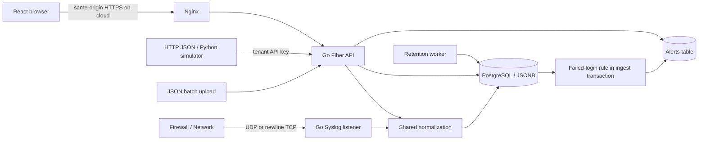

# สถาปัตยกรรม

## เหตุผลการออกแบบ

- Frontend เป็น React ที่ build ด้วย Vite ส่วน backend ใช้ Go Fiber
- backend binary ตัวเดียวดูแล HTTP API, Syslog UDP/TCP listener และ retention cleanup เพื่อติดตั้งแบบ appliance ได้ง่าย
- ฟังก์ชัน normalize ใช้ร่วมกันทั้ง HTTP ingest และ Syslog โดยแปลง provider ต่าง ๆ ให้มี field กลาง เช่น `timestamp`, `tenant`, `source`, `event_type`, `severity`, `src_ip`, `user`, `host`, `action`
- payload เดิมถูกเก็บใน `raw` และ field เสริมถูกเก็บใน `fields` แบบ JSONB
- AWS `Records` envelope ถูกแกะออกก่อน normalize, API failed login และ AD 4625 map เป็น `login_failed`, M365/AWS field สำคัญถูก map เป็น field กลาง
- ถ้า log ไม่มี timestamp จะใช้เวลารับเข้าแทน ถ้า timestamp, severity, IP หรือ tenant ไม่ถูกต้อง ระบบจะ reject
- RFC3164 Syslog จะสมมติ timezone เป็น UTC และ infer ปีปัจจุบัน มี tolerance เวลาอนาคต 5 นาทีสำหรับ clock skew
- batch ทุก record ถูก validate ก่อนเริ่ม transaction ถ้ามี record ใดผิด batch ทั้งก้อนจะไม่ถูก insert จำกัด 1,000 records และ 2 MB
- PostgreSQL ใช้ transaction, index ตาม tenant/time/source และ JSONB สำหรับ field ที่ต่างกันตาม provider การค้นหาปัจจุบันเป็น substring search บน field ที่ scoped แล้ว เหมาะกับ demo ขนาดเล็ก

## Tenant และสิทธิ์การใช้งาน

- backend enforce tenant จาก session user หรือ API key ที่ authenticate แล้วเท่านั้น ไม่ให้ user เลือก tenant จาก UI filter หรือ header เอง
- การอ่านผ่าน browser ใช้ tenant จาก session หลัง login
- การ ingest ผ่าน HTTP API ใช้ tenant ที่ผูกกับ `X-API-Key`
- ถ้า request ส่งค่า `tenant` มาไม่ตรงกับ session/API key ระบบจะ reject ไม่สลับ tenant ให้
- users, logs, API keys, rules และ alerts มี tenant กำกับ และ repository ทุกจุด query ด้วย tenant ที่ authenticate แล้ว
- Admin เป็น admin เฉพาะ tenant ของตัวเอง ไม่ใช่ super admin ข้าม tenant
- Viewer อ่านได้อย่างเดียว
- ตาราง DB เป็น shared tables พร้อม tenant column ยังไม่ได้แยก table/index ต่อ tenant
- Syslog ไม่มี authentication จึงใช้ `SYSLOG_TENANT` จาก config และ bind loopback เป็นค่าเริ่มต้น ถ้ารับจากอุปกรณ์จริงควรใช้ private network และ firewall allowlist
- password ใช้ bcrypt, session token สุ่ม 256-bit อายุ 8 ชั่วโมง และเก็บเฉพาะ SHA-256 hash ใน DB
- API key ถูก hash ก่อนเก็บใน DB เช่นกัน
- session cookie เป็น HttpOnly/SameSite=Strict และใช้ Secure เมื่อ deploy แบบ HTTPS
- request ที่แก้ข้อมูลด้วย cookie ต้องมี `Origin` ตรงกับ `APP_ORIGIN`
- seed ตอน startup จะเพิ่มเฉพาะ tenant/user demo ที่ยังไม่มีอยู่ การเปลี่ยนค่า `.env` ภายหลังจะไม่ rotate password/API key เดิมใน DB

## Alert

- กฎเริ่มต้นคือ `login_failed` จาก `src_ip` เดียวกันตั้งแต่ 5 ครั้งขึ้นไป ภายใน 5 นาที ตาม event time
- การนับและ cooldown แยกตาม tenant
- ตอน ingest จะ lock tenant row ใน transaction เพื่อลดโอกาสสร้าง alert ซ้ำจาก batch ที่เข้าพร้อมกัน
- เฉพาะ log ที่ ingest ใหม่เท่านั้นที่ trigger alert; historical replay นอกหน้าต่างเวลาไม่ trigger
- alert ถูกบันทึกใน transaction เดียวกับ logs
- UI แสดง alert และให้ Admin acknowledge ได้
- ยังไม่มี Email/Webhook delivery
- การเปลี่ยน rule มีผลกับ ingestion ถัดไป

## Retention และข้อจำกัดเชิงปฏิบัติการ

- cleanup ทำงานทันที 1 รอบตอน backend start และหลังจากนั้นทุก 1 นาทีใน config สำหรับ demo/test ตอนนี้
- retention ลบ logs ที่ `ingested_at` เก่ากว่า `RETENTION_DAYS` โดยขั้นต่ำคือ 7 วัน
- ใช้ `ingested_at` แทน `timestamp` เพื่อให้ historical samples อยู่ในระบบอย่างน้อย 7 วันหลัง import
- cleanup ลบ expired sessions ด้วย
- alerts ยังไม่มี retention policy แยก
- operator ต้องดูแล backup volume และ disk usage เอง
- UDP เป็น best effort ไม่มี acknowledgement และไม่มี durable queue
- TCP ใช้ newline framing จำกัด 64 KB ต่อ line จำกัด connection 32 และ idle timeout 30 วินาที
- ไม่มี deduplication ถ้าส่งซ้ำจะเป็น event ใหม่
- ยังไม่มี benchmark throughput/latency สำหรับ production load
