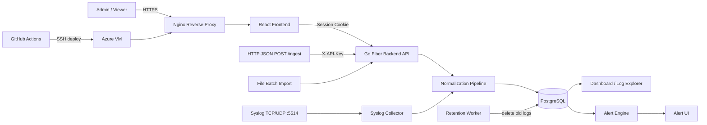

# สถาปัตยกรรมระบบ Logdesk

Logdesk เป็นระบบจัดการ log แบบ multi tenant สำหรับรับ log หลายช่องทาง ค้นหา วิเคราะห์ แจ้งเตือน และแสดงผลผ่านเว็บ UI ระบบรองรับทั้งโหมด Appliance ที่รันด้วย Docker Compose และโหมด SaaS demo ผ่าน HTTPS บน Azure VM

## ภาพรวมระบบ



## Component หลัก

| ส่วน | หน้าที่ |
|---|---|
| React Frontend | หน้า Login, Dashboard, Log Explorer, Alerts และ Data Source |
| Nginx | Serve frontend และ reverse proxy ไป backend ในโหมด SaaS HTTPS |
| Go Fiber Backend | REST API, authentication, RBAC, ingest, search, dashboard, alert และ retention worker |
| Syslog Collector | รับ Syslog TCP/UDP ที่ port 5514 แล้วส่งเข้า normalization pipeline |
| PostgreSQL | เก็บ users, API keys, events, alert rules, alert history และ sessions |
| GitHub Actions | รัน CI และ deploy ไป Azure VM ผ่าน SSH เมื่อ push เข้า branch `deploy` |

## ช่องทางรับ log

ระบบรับ log ได้ 3 รูปแบบหลัก

1. **HTTP JSON**
   - ใช้ endpoint `POST /ingest`
   - ระบุ tenant ผ่าน `X-API-Key`
   - เหมาะกับ Postman, script และ integration ที่ส่ง JSON ได้

2. **Syslog TCP/UDP**
   - รับที่ port `5514`
   - TCP ใช้ newline framing
   - UDP เป็น best effort ไม่มี acknowledgement
   - Syslog ไม่มี authentication ในตัว ระบบจึงใช้ค่า `SYSLOG_TENANT` จาก config เพื่อกำหนด tenant ของ collector

3. **File batch import**
   - ใช้ import sample log เช่น AWS, Microsoft 365 และ Active Directory
   - ระบบ normalize record แต่ละรายการก่อนบันทึก

## Normalization

Normalization pipeline แปลง log จากหลาย source ให้เป็น field กลาง เพื่อให้ค้นหาและแสดง dashboard แบบเดียวกันได้

Field กลางที่ใช้บ่อย ได้แก่

- `tenant`
- `source`
- `event_type`
- `severity`
- `src_ip`
- `username`
- `host`
- `action`
- `timestamp`
- `raw`
- `fields`

ถ้า log ไม่มี `timestamp` ระบบใช้เวลาที่ ingest เข้ามาแทน เพื่อให้ log แสดงใน timeline และ filter ตามเวลาได้

## Tenant isolation และ RBAC

ระบบใช้ shared database tables แต่ทุก record มี `tenant` กำกับ และ backend enforce tenant ทุก request

| ช่องทาง | วิธีกำหนด tenant |
|---|---|
| Browser UI | ใช้ tenant จาก session หลัง login |
| HTTP ingest | ใช้ tenant ที่ผูกกับ `X-API-Key` |
| Syslog | ใช้ค่า `SYSLOG_TENANT` จาก config |

หลักการสำคัญคือ UI ไม่ให้ผู้ใช้เลือก tenant เอง เพราะ tenant ต้องถูกบังคับจาก backend เท่านั้น

Role ที่มีในระบบ

- **Admin**: จัดการข้อมูลภายใน tenant ของตัวเอง เช่น ดู log, สร้าง alert rule และ acknowledge alert
- **Viewer**: อ่านข้อมูลได้เฉพาะ tenant ของตัวเอง

Admin ในระบบนี้เป็น admin ระดับ tenant ไม่ใช่ super admin ข้าม tenant

## Authentication และ Security

- Password ใช้ bcrypt
- Session token เป็นค่าสุ่มและเก็บเป็น hash ใน database
- API key ถูก hash ก่อนเก็บใน database
- Session cookie ใช้ `HttpOnly` และ `SameSite=Strict`
- เมื่อ deploy ผ่าน HTTPS ระบบตั้ง cookie แบบ `Secure`
- Request ที่แก้ข้อมูลผ่าน cookie ต้องมี `Origin` ตรงกับ `APP_ORIGIN`

## Alert

ตอนนี้ระบบมีเงื่อนไข alert หลักเพียงแบบเดียว คือแจ้งเตือนเมื่อพบ log field ที่ rule กำหนดติดต่อกันครบ **5 ครั้งภายใน 5 นาที** ภายใน tenant เดียวกัน

ตัวอย่างที่ใช้ทดสอบใน demo คือ failed login จาก IP เดียวกัน 5 ครั้งภายใน 5 นาที แล้วระบบสร้าง alert history และแสดงผลในหน้า Alert UI

หลักการทำงานปัจจุบัน

- ตรวจเฉพาะ log ที่ ingest เข้ามาใหม่
- นับภายใน tenant เดียวกันเท่านั้น
- ใช้ time window 5 นาที
- ครบ 5 ครั้งจึงสร้าง alert
- Admin สามารถ acknowledge alert ได้ใน UI

ตอนนี้ระบบรองรับการแจ้งเตือนผ่าน UI เป็นหลัก ยังไม่มี email หรือ webhook delivery

## Retention

Retention worker ทำงานใน backend เพื่อกำหนดอายุข้อมูลขั้นต่ำตามโจทย์

- ค่า retention ขั้นต่ำคือ 7 วัน ผ่าน `RETENTION_DAYS`
- ระบบลบ log ที่ `ingested_at` เก่ากว่า retention policy
- ใช้ `ingested_at` แทน `timestamp` เพื่อให้ historical samples ที่ import เข้ามายังอยู่ครบตามวันที่ ingest
- ตอนนี้ตั้ง interval เป็น 1 นาทีเพื่อสะดวกต่อการ demo/test
- worker ล้าง expired sessions ด้วย

## Deployment

### Appliance mode

ใช้สำหรับรันระบบบนเครื่องเดียวหรือ VM ด้วย Docker Compose

```powershell
docker compose up --build -d
```

Service หลักใน Docker Compose

- frontend
- backend
- postgres

### SaaS mode

ระบบ demo deploy บน Azure VM และเข้าใช้งานผ่าน HTTPS

```text
https://logdisk.malaysiawest.cloudapp.azure.com
```

Port ที่ใช้

| Port | ใช้สำหรับ |
|---|---|
| 80 | HTTP / Certbot challenge |
| 443 | HTTPS web app |
| 5514 TCP | Syslog TCP |
| 5514 UDP | Syslog UDP |

## CI/CD

ใช้ GitHub Actions แยกเป็น 2 workflow

1. **CI**
   - รันบน push/PR ไป `main`
   - ตรวจ Go test, Go vet, frontend build และ Docker Compose config

2. **Deploy**
   - รันเมื่อ push เข้า branch `deploy`
   - SSH เข้า Azure VM
   - pull code ล่าสุด
   - rebuild และ restart container ด้วย Docker Compose

Secrets ที่ใช้ใน GitHub Actions

- `AZURE_HOST`
- `AZURE_USER`
- `AZURE_SSH_KEY`

## ข้อจำกัดปัจจุบัน

- Syslog ไม่มี authentication จึงควรเปิดรับผ่าน firewall allowlist หรือ private network ใน production
- UDP อาจสูญหายได้ตามธรรมชาติของ protocol
- ยังไม่มี durable queue สำหรับ log ingestion
- ยังไม่มี email/webhook delivery สำหรับ alert
- ยังไม่มี benchmark throughput/latency สำหรับ production load

## Diagram สำหรับนำเสนอ

มีไฟล์ diagram ที่ใช้ทำสไลด์ได้ใน `docs/`

- `architecture-dark-pipeline.html` สำหรับ screenshot style dark pipeline
- `architecture-detailed.html` สำหรับภาพละเอียดแบบเว็บ
- `tech-stack-slide.html` สำหรับ Tech Stack

