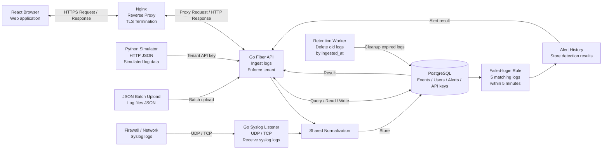

# สถาปัตยกรรมระบบ Logdesk

เอกสารนี้อธิบายสถาปัตยกรรมของ Logdesk ตาม flow ใน architecture diagram โดยแยกเป็นส่วนรับ log, web application, backend API, normalization, database, alert และ retention

## Architecture diagram



## ภาพรวมการทำงาน

Logdesk มี backend เป็นศูนย์กลาง ระบบรับ log จาก 3 ช่องทางหลัก แล้วส่งเข้า normalization pipeline ก่อนบันทึกลง PostgreSQL จากนั้น UI ใช้ backend API เพื่อค้นหา log, ดู dashboard และดู alert

Flow หลักมีดังนี้

1. ผู้ใช้เปิด React web application ผ่าน HTTPS
2. Nginx ทำ TLS termination และ reverse proxy request ไป Go Fiber API
3. Go Fiber API ตรวจ session, role และ tenant ก่อนอ่านหรือเขียนข้อมูล
4. Log เข้าระบบผ่าน HTTP JSON, JSON batch upload หรือ Syslog TCP/UDP
5. ทุก log ถูกส่งผ่าน shared normalization เพื่อ map เป็น field กลาง
6. PostgreSQL เก็บ events, users, API keys, alert history และข้อมูลอื่นของระบบ
7. Alert rule ตรวจ failed login หรือ log field ที่ rule กำหนดครบ 5 ครั้งภายใน 5 นาที
8. Retention worker ลบ log เก่าตาม `ingested_at` และ retention policy

## Component ตาม diagram

| Component | หน้าที่ |
|---|---|
| React Browser Web application | หน้าเว็บสำหรับ Login, Overview, Log Explorer, Alerts และ Data Sources |
| Nginx Reverse Proxy / TLS Termination | รับ HTTPS, serve frontend และ proxy request ไป backend |
| Go Fiber API | จัดการ authentication, RBAC, ingest, search, dashboard, alert และ tenant enforcement |
| Python Simulator HTTP JSON | script สำหรับยิง log ตัวอย่างผ่าน `POST /ingest` |
| JSON Batch Upload | import log file JSON เช่น AWS, M365, AD และ abnormal logs |
| Firewall / Network | แหล่ง Syslog จากอุปกรณ์ เช่น firewall, router หรือ sender script |
| Go Syslog Listener | รับ Syslog TCP/UDP ที่ port `5514` |
| Shared Normalization | แปลง log หลาย format ให้เป็น field กลางเดียวกัน |
| PostgreSQL | เก็บ events, users, API keys, sessions, alert rules และ alert history |
| Failed-login Rule | rule ปัจจุบันที่แจ้งเตือนเมื่อเจอ log field ครบ 5 ครั้งภายใน 5 นาที |
| Alert History | เก็บผลการแจ้งเตือนและสถานะ acknowledge |
| Retention Worker | ลบ log เก่ากว่า retention policy โดยอิง `ingested_at` |

## ช่องทางรับ log

### HTTP JSON

ใช้สำหรับส่ง log จาก script, Postman หรือระบบอื่นที่เรียก HTTP API ได้

```text
POST /ingest
X-API-Key: <tenant api key>
```

Tenant ของ log ที่เข้าผ่าน HTTP JSON มาจาก API key ไม่ได้มาจากค่าที่ผู้ใช้เลือกเองใน UI

### JSON Batch Upload

ใช้สำหรับ import ไฟล์ sample เช่น

- AWS
- Microsoft 365
- Active Directory
- abnormal logs สำหรับ trigger alert

ถ้า upload ผ่าน UI ต้อง login เป็น Admin ของ tenant นั้น

### Syslog TCP/UDP

Syslog listener รับที่ port `5514`

| Protocol | ใช้สำหรับ |
|---|---|
| UDP | ส่ง log แบบเร็ว best effort |
| TCP | ส่ง log แบบ newline framed |

Syslog ไม่มี authentication ในตัว ระบบจึงใช้ค่า `SYSLOG_TENANT` จาก config เพื่อกำหนด tenant ของ log ที่เข้าผ่าน collector

## Shared normalization

ทุกช่องทาง ingest ใช้ normalization pipeline เดียวกัน เพื่อให้ log ต่าง source ถูกค้นหาและแสดงผลร่วมกันได้

Field กลางที่ใช้บ่อย

- `tenant`
- `source`
- `event_type`
- `severity`
- `src_ip`
- `username`
- `host`
- `action`
- `timestamp`
- `raw`
- `fields`

ถ้า log ไม่มี `timestamp` ระบบใช้เวลาที่ ingest เข้ามาแทน

## PostgreSQL

PostgreSQL เป็น database หลักของระบบ เก็บข้อมูลใน shared tables พร้อม tenant column

ข้อมูลสำคัญที่เก็บ

- users
- sessions
- API keys
- events
- alert rules
- alert history

Backend ทุก query จะ scope ด้วย tenant ที่ authenticate แล้วเสมอ

## Tenant enforcement และ RBAC

Logdesk ไม่ให้ผู้ใช้เลือก tenant เองจาก UI เพราะ tenant ต้องถูก enforce จาก backend

| ช่องทาง | Tenant มาจาก |
|---|---|
| Browser UI | session หลัง login |
| HTTP JSON | API key |
| JSON batch ผ่าน UI | session ของ Admin |
| Syslog TCP/UDP | `SYSLOG_TENANT` |

Role ที่มี

- **Admin**: จัดการข้อมูลภายใน tenant ของตัวเอง เช่น ingest, ตั้ง alert rule และ acknowledge alert
- **Viewer**: อ่าน dashboard/logs/alerts ของ tenant ตัวเองเท่านั้น

Admin เป็น admin ระดับ tenant ไม่ใช่ super admin ข้าม tenant

## Alert flow

Alert ปัจจุบันมีเงื่อนไขหลักเดียว คือแจ้งเตือนเมื่อพบ log field ที่ rule กำหนดครบ **5 ครั้งภายใน 5 นาที** ภายใน tenant เดียวกัน

ตัวอย่างใน demo คือ failed login จาก IP เดียวกัน 5 ครั้งภายใน 5 นาที

Flow ของ alert

1. Log ถูก ingest และ normalize
2. Event ถูกบันทึกลง PostgreSQL
3. Failed-login rule ตรวจ event ภายใน tenant เดียวกัน
4. ถ้าครบ 5 ครั้งภายใน 5 นาที ระบบสร้าง alert history
5. หน้า Alerts แสดง alert ให้ Admin/Viewer เห็นตามสิทธิ์
6. Admin สามารถ acknowledge alert ได้

ตอนนี้ระบบรองรับ alert ผ่าน UI ยังไม่มี email หรือ webhook delivery

## Retention flow

Retention worker ทำงานใน backend และลบ log เก่าตาม policy

- ค่า retention ขั้นต่ำคือ 7 วันผ่าน `RETENTION_DAYS`
- ลบโดยอิง `ingested_at`
- ใช้ `ingested_at` เพื่อให้ historical samples ที่ import เข้ามายังอยู่ครบตามวันที่ ingest
- interval ปัจจุบันตั้งไว้ 1 นาทีเพื่อ demo/test
- worker ล้าง expired sessions ด้วย

## Deployment

### Appliance mode

รันด้วย Docker Compose บนเครื่องเดียวหรือ VM

```powershell
docker compose up --build -d
```

### SaaS mode

ระบบ demo deploy บน Azure VM และเข้าใช้งานผ่าน HTTPS

```text
https://logdisk.malaysiawest.cloudapp.azure.com
```

Port ที่ใช้

| Port | ใช้สำหรับ |
|---|---|
| 80 | HTTP / Certbot challenge |
| 443 | HTTPS web app |
| 5514 TCP | Syslog TCP |
| 5514 UDP | Syslog UDP |

## CI/CD

ใช้ GitHub Actions

- branch `main`: run CI เช่น Go test/vet, frontend test/build และ Docker Compose config
- branch `deploy`: SSH เข้า Azure VM แล้วรัน `docker compose up -d --build`

Secrets ที่ใช้

- `AZURE_HOST`
- `AZURE_USER`
- `AZURE_SSH_KEY`

## ข้อจำกัดปัจจุบัน

- Syslog ไม่มี authentication จึงควรใช้ firewall allowlist หรือ private network ใน production
- UDP เป็น best effort และไม่มี acknowledgement
- ยังไม่มี TLS Syslog
- ยังไม่มี durable queue, retry หรือ deduplication
- Alert ยังไม่มี email/webhook delivery
- ยังไม่มี benchmark throughput/latency สำหรับ production load
